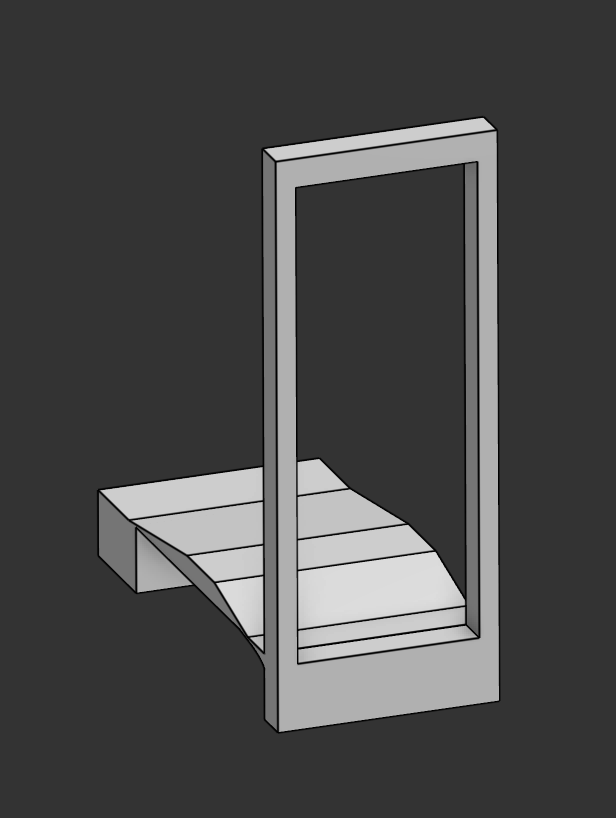
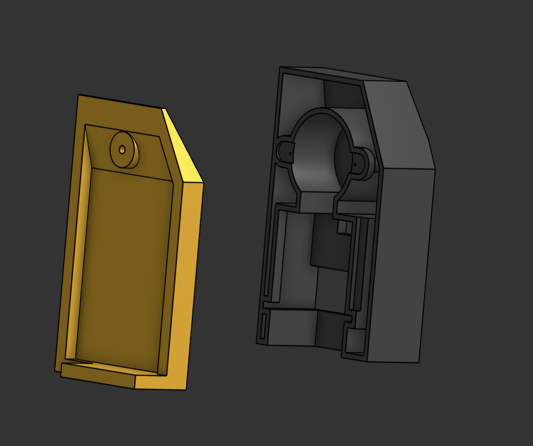
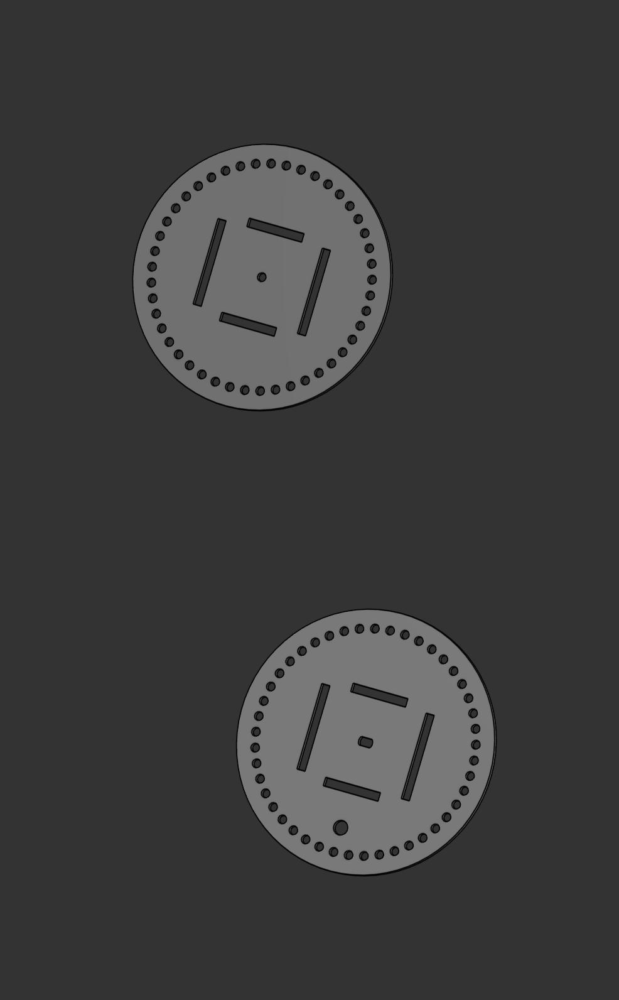

# Split flap flight-tracker display
---
## Images

## Whots this UwU?
It's a split flap display with 18 characters designed to show just enough info to track flights. It uses an ESP32 to send API requests to [AviationStack](https://docs.apilayer.com/aviationstack/docs/api-documentation) (oof, only 100 req/mo), and displays the info accordingly.

The display has 3 rows, the first row has 7 characters (1 showing logos, 2 showing airline IATA code, 4 showing flight number), the 2nd row has 6 characters showing the origin and destination airport, the 3rd row has 5 alphanumeric characters and shows flight status (INFLT, DELAY, CNCLD, BRDNG), or time (23:59, 5 DAYS, 5 HRS, 3H49M, etc) which could be configured to different modes (only show status, only show time, or switch between the two).

Each character is its own module and can function independently with 45 character positions each, and the PCB designs makes this simple to do. Each module also includes a magnet and a hall effect sensor for calibration.

## Dimensions
Each module by itself is 9cm wide, up to 14.5cm tall, and up to 10cm thick.
The entire system is 64.3cm wide, 47cm tall, and 15cm thick.

## CAD & PCB
This was designed in Onshape and KiCad.

## Other details:
This uses 1 ESP32 DevKit v1, 2 Arduino Unos, and 1 Arduino Mega. This is not the best way to do it, I only did this because I'm dead broke and that's what i had.
This project uses the MIT License.
