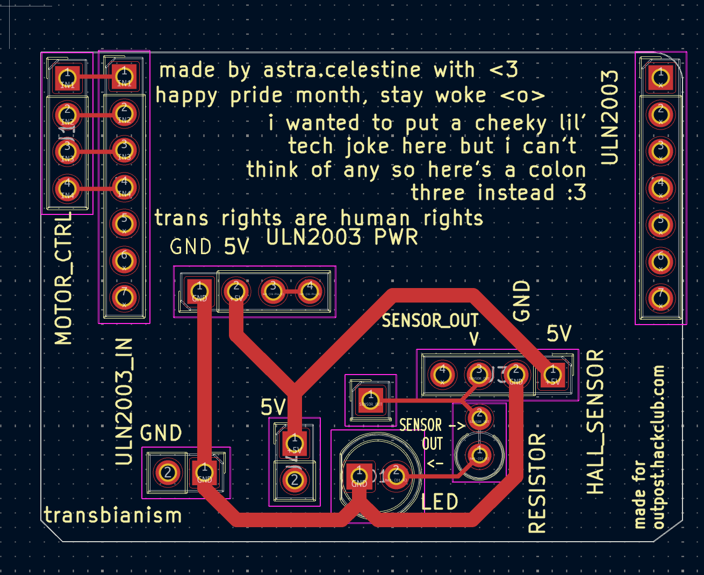
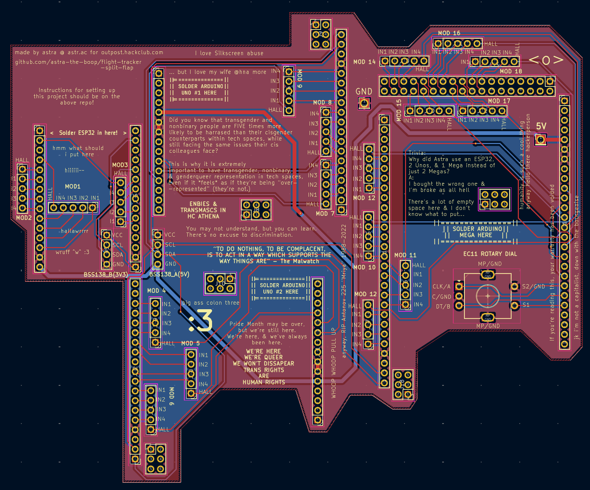

# Firmware
> ## Waiting to complete firmware code until I have the required hardware so this is completely untested, but here's a complete rundown of the code's logic:

## Module level:
The module has 4 input pins (INPUT1-4) relevant for controlling the motors. It also has 1 Hall effect sensor output pin, and a 5V and GND pin connected to the power supply (irrelevant to code).

Modules 1-3 is controlled and connected to the ESP32
Modules 4-6 is controlled by Arduino Uno 1, 7-9 is controlled by Uno 2.
Modules 10-18 are controlled by the Arduino Mega.

Where the 5 pins are connected to and where each module should be soldered to are labeled on the Main PCB's silkscreen (MOD*), (HALL is the hall effect sensor's input, IN1-4 is INPUT1-4).

## Retrieving data
The ESP32 sends RESTful GET requests to [AviationStack](https://aviationstack.com/)'s [/v1/timetable](https://docs.apilayer.com/aviationstack/docs/aviationstack-api-v-1-0-0#/default/getFlightSchedule) endpoint for the saved flight code. (Note: Free version is limited to 100 req/mo)
This uses the HTTPClient library (dependencies: Wifi.h, HTTPClient.h, WifiClientSecure.h, ArduinoJson.h)

## Parsing
As shown in README.md, there's 18 characters.
Char 1 (Logo): Have a set array of up to 44 of your most likely to be used airlines' IATA code (e.g. "CX"). From response["data"]["airline"]["iataCode"], search for that IATA code from the array, if found, return the index, else return 0 (blank).
Char 2 (IATA): response["data"]["airline"]["iataCode"][0]
Char 3: response["data"]["airline"]["iataCode"][1]
Char 4 (flight code): response["data"]["flight"]["number"][0]
Char 5-7: response["data"][... ...][1-3]
Char 8-10: response["data"]["departure"]["iataCode"][0-2]
Char 11-13: response...["arrival"][...][0-2]
Char 14-18: 
In case of showing time: response...["departure"]["scheduledTime"].substring(11,16) or response...["arrival"]... in if flight is already in air.
In case of showing flight status: Have 2 arrays of different statuses and the shortened version (e.g. ["boarding", "delayed", ...] ["BRDNG", "DELAY", ...]. Get response...["status"], get index of it in the first array, get the value of that index at the 2nd array.

Parse the value of that string substringed [0-5]

## Displaying
For the modules directly connected to the ESP32, the ESP32 uses AccelStepper to control the motors' position, movement, and acceleration. AccelStepper allows for simultanious commands while the default Stepper lib only allows for async execution.
The motor shall rotate until the hall effect sensor sends a signal (using INPUT_PULLUP), which then sets the index to 0. There shall be an array of characters (e.g. [BLANK/DEFAULT, A, B, C, ..., 8, 9, 0, -, :, " ", ...]) with 45 items, program starts a for loop until it reaches the desired character, for each loop, the motor rotates by 8º (AccelStepper allows for motor control by degrees), and increases the counter by 1.

For modules that aren't connected directly to the ESP32, the ESP32 shall send the desired character to be displayed to the Arduino Unos or Mega via I²C, and then it does the above.

## Input
There's a rotary encoder switch on the Arduino Mega, so the Mega shall receive input from the rotary encoder switch via INPUT_PULLUP, and relay it back to the ESP32 via I²C.
On the ESP32's memory, there shall be a string variable which represents the flight code.
By default, the displays show nothing, and the current mode is set to read only.
When a signal is received from the rotary encoder's CLK pin, Arduino mega starts a timer until it's released, if it's longer than 1500ms, then it relays a signal to the ESP32 to change to edit mode.
In edit mode, there is an index (pointer) variable set at 0 (representing flightCode[0] (the string we set earlier)). Rotating the encoder clockwise moves the value of the chracter of which the pointer is pointing to is set to the next item (or loops over to [0] if it's [-1]) of the array of characters we set earlier (blank, A-Z, 1-9, 0, special characters). Vice versa for counterclockwise. The motor moves 8º (or -8º for ccw) without checking for hall effect sensor homing.
Receiving a single click would move it to the next pointer position (or in case of [4], moves to [0]), a single click is a click where the timer ends <1500ms.
Once in edit mode and a long click (≥1500m) happens, all characters in flightCode.substr(2, 4) that is not either blank or an integer is replaced with '0' and if it's blank, it's replaced with '', and reformatted after such that it's a 4 digit number (e.g. 12 -> 0012). After which, a regular display reload would occur as described previously (i.e. does a rotation until sensor detects magnet, then rotate 8º until reaches the desired character). An API request to AviationStack would then be made and data is saved to request variable. After which it goes through the process of refreshing, requesting, parsing, and displaying as previously displayed.

## Refreshing
3 variables are set for the data refresh rates, one for 90 minutes until scheduled flight, one for 9 hours until scheduled flights, and one for all before that. (Would've just had everything at a really short refresh time if not for the fact that you only get like 100 FUCKING REQUESTS A MONTH FOR SOME REASON. IT'S THE BEST FUCKING OPTION TOO EVERYTHING ELSE IS PAID)
Just does a loop with the set time where each loop goes through the fetch-~~decode-execute~~parse-display cycle.

